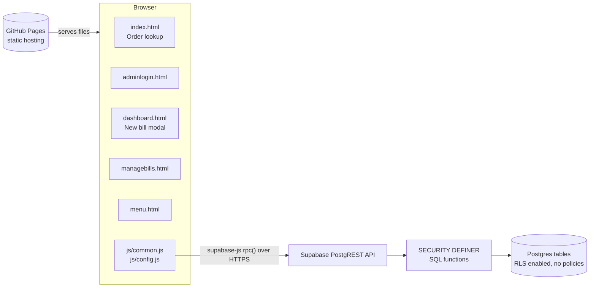
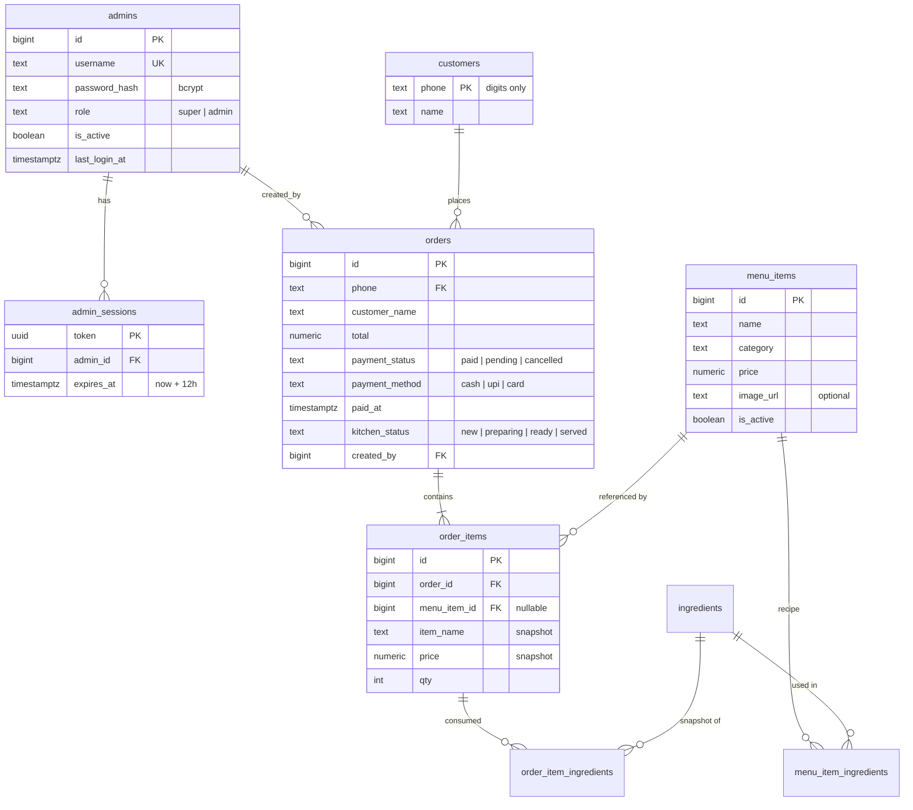
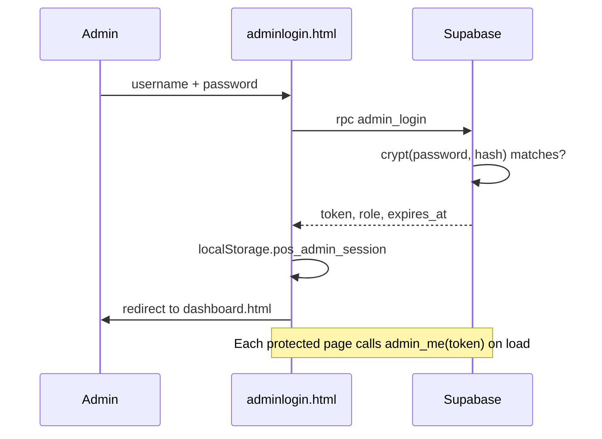
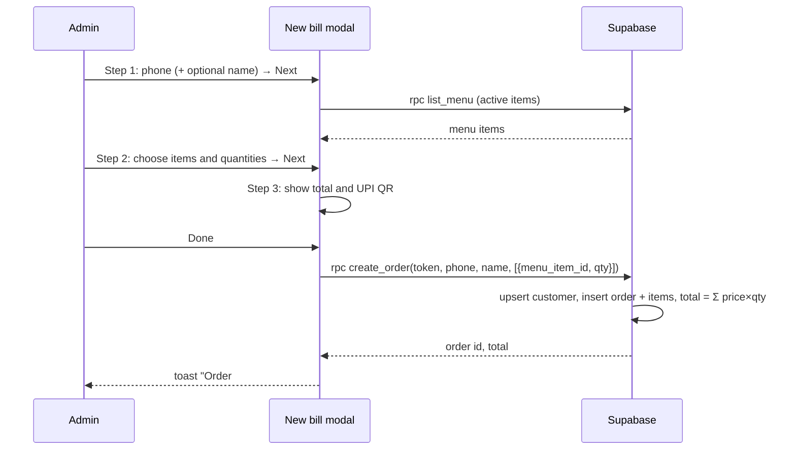

# Architecture

POS Billing is a static web app with no application server. The browser loads plain HTML/CSS/JS from GitHub Pages and talks directly to a Supabase Postgres database through RPC (remote procedure call) functions.

## High-level overview



| Layer | Technology | Responsibility |
|---|---|---|
| Hosting | GitHub Pages | Serves static files from the `main` branch |
| UI | HTML, CSS, vanilla JavaScript | Pages, forms, modal, rendering |
| Client SDK | `@supabase/supabase-js` v2 (CDN) | Calls database functions via `rpc()` |
| QR code | `qrcodejs` (CDN) | Renders the UPI payment QR on the payment step |
| API | Supabase PostgREST | Exposes Postgres functions as HTTP endpoints |
| Business logic + auth | PL/pgSQL functions | Login, sessions, role checks, order totals |
| Storage | Supabase Postgres | Admins, sessions, menu, customers, orders |

## Project structure

```
POS_Billing/
├── index.html          Public landing page: search order history by phone
├── adminlogin.html     Admin login form
├── dashboard.html      Admin dashboard: shift bar, bento cards, awaiting payment, New bill modal, shift modal
├── managebills.html    Super admin: list / search / status / delete orders
├── menu.html           Super admin: add / edit / hide / delete menu items, link ingredients
├── ingredients.html    Super admin: ingredients, stock purchase / waste / count, tracking, history
├── usage.html          Super admin: ingredient usage report (IST days, CSV export)
├── staff.html          Super admin: users, roles, password resets, sign-outs
├── settings.html       Super admin: shop name, address, UPI ID, currency, receipt footer
├── audit.html          Super admin: audit log with area filter and search
├── account.html        Any admin: change own password
├── kitchen.html        Any admin: kitchen display (new / preparing / ready columns, live refresh, chime)
├── sales.html          Super admin: sales KPIs, by-day / by-hour bars, methods, top items, staff, shift closes
├── css/
│   └── style.css       Shared styles, responsive layout, dark mode
├── js/
│   ├── config.js       Supabase URL + publishable key; fallback shop settings
│   └── common.js       Shared helpers exposed as window.App
├── supabase/
│   └── schema.sql      Tables, RLS, functions, grants (run once in SQL Editor)
└── docs/
    ├── ARCHITECTURE.md This file
    └── USER_GUIDE.md   Features and how to use them
```

Each HTML page loads scripts in this order: `supabase-js` → `config.js` → `common.js` → an inline page script.

### `js/common.js` (window.App)

| Helper | Purpose |
|---|---|
| `db` | Supabase client created from `APP_CONFIG` |
| `applySettings(s)` | Merges `get_settings()` into `cfg` (cached in `localStorage` as `pos_settings` for first paint) and updates `[data-shop-name]`. Loaded on every page; `requireAdmin` waits for it |
| `upiConfigured()` | False while the UPI ID is empty or the sample; `renderQR` then shows a warning |
| `rpc(fn, args)` | Calls a database function; throws on error; on an expired session (`28000`) clears the session and redirects to login |
| `session.get/set/clear` | Stores the admin session in `localStorage` (`pos_admin_session`); ignores expired sessions |
| `requireAdmin({ superOnly })` | Page guard: validates token with `admin_me`, redirects to login or dashboard if not allowed |
| `logout()` | Deletes the server session and returns to login |
| `money`, `fmtDate`, `esc`, `digits` | Formatting, HTML escaping, phone normalisation |
| `toast(msg, type)` | Small notification popup |
| `renderItems(items)` | Renders order line items as a list |
| `methodLabel(m)` | `cash`/`upi`/`card` → display label |
| `renderQR(el, amount)` | Draws the UPI payment QR for an amount |
| `printReceipt(order)` | Fills a hidden `#receipt-print` block (58 mm layout, print-only CSS) and opens the print dialog |
| `printShiftReport(shift)`, `cashDiff(d)` | 58 mm shift report; counted − expected → Short by / Over by / Exact match |
| `whatsappUrl(order)` | `wa.me` link with the bill summary; prefixes `COUNTRY_CODE` to 10-digit phones |

## Database design



Other tables (not all columns shown above):
- `settings` — exactly one row (`id = 1`): shop name, address, phone, currency, UPI ID, country code, receipt footer.
- `audit_log(admin_id, admin_username snapshot, action, entity_id, details jsonb, created_at)` — `action` is `area.verb` (`order.status`, `menu.update`, `staff.create`, …). Updates store `details.changes = {field: [old, new]}` (built by `_jsonb_diff`); deletes store a snapshot of the row.
- `shifts(admin_id, opened_at, opening_cash, closed_at, closed_by, counted_cash, expected_cash, difference, totals jsonb, note)` — one open shift per admin (partial unique index). Expected cash = opening + that admin's paid cash bills created during the shift; `totals` (cash/upi/card/sales/pending/cancelled) is frozen at close.
- `ingredients` also has `track_stock`, `stock`, `low_stock_at`; `settings.hide_out_of_stock` (default true).
- `stock_movements(ingredient_id, kind purchase|waste|adjust|sale|sale_reversal, qty signed, balance_after, order_id, admin_id, note)` — every stock change.
- `login_attempts(username, ip, succeeded, created_at)` — rate-limit window, purged after a day.
- `ingredients(id, name unique case-insensitive, unit in g|kg|ml|l|pcs)`
- `menu_item_ingredients(menu_item_id, ingredient_id, qty)` — quantity per **one** unit of the menu item; PK on both IDs.
- `order_item_ingredients(order_id, order_item_id, ingredient_id nullable, ingredient_name, unit, qty)` — written by `create_order` as recipe qty × ordered qty.

Design notes:
- **Ingredient snapshots** make a daily consumption report a simple query that is unaffected by later recipe edits:
  ```sql
  select (o.created_at at time zone 'Asia/Kolkata')::date as day, oii.ingredient_name, oii.unit, sum(oii.qty) as total
  from order_item_ingredients oii join orders o on o.id = oii.order_id
  where o.payment_status <> 'cancelled'
  group by 1, 2, 3 order by 1 desc, 2;
  ```
- **Price and name snapshots** in `order_items` keep old bills correct after a menu item is renamed, repriced or deleted (`menu_item_id` becomes `NULL`).
- **Phone numbers** are stored as digits only, so `98765 43210` and `9876543210` match the same customer.
- **Deleting an order** cascades to its `order_items`.
- **Stock.** `create_order` calls `_stock_deduct_order` after writing the ingredient snapshot: tracked ingredients are locked (`for update`, id order) and reduced; with `hide_out_of_stock` on it raises `Not enough …` (whole bill rolls back), otherwise it allows negative stock and returns `stock_warnings`. Cancelling or deleting a non-cancelled bill runs `_stock_restore_order`, which reverses the order's net movements; un-cancelling deducts again. Untracked ingredients are ignored.
- **Kitchen live refresh.** A statement trigger on `orders` (insert, delete, update of `kitchen_status`/`payment_status`) calls `realtime.send('{}', 'orders', 'kitchen', false)`: an empty broadcast on a public Realtime topic. No order data is broadcast; `kitchen.html` reacts by calling `kitchen_orders(token)`, and also polls every 10 s. The trigger swallows errors and is skipped if Realtime is missing, so billing never fails because of it. Orders existing when migration 009 ran were marked `served`.
- Indexes: `orders(phone, created_at desc)` for lookup, `order_items(order_id)` for joins.

## Security model

The Supabase publishable (anon) key is public by design — it is in `config.js` and visible to anyone. Security therefore lives entirely in the database:

1. **RLS on, no policies.** Every table has Row Level Security enabled with zero policies, so the anon key cannot `select`, `insert`, `update` or `delete` any table directly.
2. **Access only through functions.** Functions are `SECURITY DEFINER`: they run as the owner and can touch tables, but only in the ways they are written to. `execute` is granted to `anon` only for the intended functions; the internal `_require_admin` helper is not callable from outside.
3. **Hashed passwords.** `admins.password_hash` uses bcrypt via `pgcrypto` (`crypt()` + `gen_salt('bf')`). Passwords never leave the database and are never returned to the browser. Empty or null passwords are always rejected.
4. **Login rate limit.** `admin_login` records every attempt in `login_attempts` (username, client IP from `x-forwarded-for`). 5 failures per username (reset by a success) or 20 per IP within 15 minutes block further attempts. Rows older than a day are purged on each login. Trade-off: someone who knows a username can keep it locked; the IP limit and the short window keep that small.
5. **Audit trail.** Every super admin change (and payment confirmations) writes to `audit_log` inside the same transaction as the change. The log has no update/delete RPC.
6. **Session tokens.** `admin_login` returns a random UUID token valid for 12 hours, stored in `admin_sessions`. Every admin function receives `p_token` and calls `_require_admin(token, super_required)`.
7. **Roles enforced server-side.** Hiding cards in the UI is cosmetic; super-only functions raise `Super admin access required.` for a normal admin even if called directly.
8. **Server-side totals.** `create_order` receives only menu item IDs and quantities. Prices come from `menu_items`, and only active items are accepted.
9. **XSS protection.** All user-supplied text is passed through `App.esc()` before being inserted into HTML.

Known trade-off: `get_orders_by_phone` is public, so anyone who knows a phone number can see that customer's history (capped at 100 orders, minimum 6 digits). Add OTP verification if this is a concern.

## RPC function reference

| Function | Access | Description |
|---|---|---|
| `admin_login(p_username, p_password)` | Public | Rate-limited (5 failures per username or 20 per IP in 15 min). Returns `{token, username, role, expires_at}` or `{error}` (errors are returned, not raised, so failed attempts are recorded) |
| `admin_logout(p_token)` | Public | Deletes the session |
| `admin_me(p_token)` | Any admin | Returns `{username, role}`; used as a page guard |
| `change_my_password(p_token, p_current, p_new)` | Any admin | Verifies current password, min 8 chars, signs out the user's other sessions; audited |
| `get_settings()` | Public | Shop settings |
| `update_settings(p_token, p_settings)` | Super admin | Validates and saves all settings; audited with changed fields |
| `list_admins(p_token)` | Super admin | Users with last login, active session count, `is_me` |
| `upsert_admin(p_token, p_id, p_username, p_role, p_is_active, p_password)` | Super admin | Create (password required) or update (blank password keeps it). Can't demote/disable yourself. Role/password change or deactivation deletes that user's sessions; audited |
| `revoke_admin_sessions(p_token, p_id)` | Super admin | Deletes a user's sessions (keeps the caller's); returns count; audited |
| `list_audit_log(p_token, p_category, p_search, p_limit, p_offset)` | Super admin | Paged log; category = action prefix (`order`, `menu`, `ingredient`, `staff`, `settings`); search matches user, entity ID or details text |
| `kitchen_orders(p_token)` | Any admin | `{server_time, active, served}`: active = not served/cancelled from the last 24h (oldest first, max 100); served = last 10 served in 2h |
| `set_kitchen_status(p_token, p_id, p_status)` | Any admin | `new`/`preparing`/`ready`/`served`; rejects cancelled orders; audited |
| `menu_stock(p_token)` | Any admin | `{hide_out_of_stock, items: {menu_item_id: {status ok|low|out, can_make, short:[{name, unit, stock, need}]}}}` for items with tracked ingredients |
| `low_stock(p_token)` | Any admin | Tracked ingredients at or below `low_stock_at` (or zero) |
| `record_stock(p_token, p_ingredient_id, p_kind, p_qty, p_note)` | Super admin | `purchase` (+), `waste` (−), `count` (set); turns tracking on; audited |
| `update_stock_settings(p_token, p_id, p_track, p_low_stock_at)` | Super admin | Tracking on/off and alert level; audited |
| `list_stock_movements(p_token, p_ingredient_id, p_limit)` | Super admin | Latest movements (max 200) |
| `current_shift(p_token)` | Any admin | Own open shift with live totals and expected cash, or `null` |
| `open_shift(p_token, p_opening_cash)` | Any admin | Opens a shift; one open shift per user; audited |
| `close_shift(p_token, p_counted_cash, p_note, p_shift_id?)` | Any admin (own) / super admin (any, by id) | Freezes totals, stores expected/counted/difference; audited |
| `list_shifts(p_token, p_from, p_to)` | Super admin | Shifts opened between IST dates (max 200) |
| `sales_report(p_token, p_from, p_to)` | Super admin | IST range (max 1 year): `summary` (paid orders, sales, avg), `pending`, `cancelled`, `by_method`, `by_day` (every day filled), `by_hour` (0–23), `top_items` (top 10 by revenue), `by_staff` |
| `get_orders_by_phone(p_phone)` | Public | Customer order history with items, newest first |
| `list_menu(p_token, p_include_inactive)` | Any admin (active items); super admin (with hidden items) | Menu sorted by category and name |
| `create_order(p_token, p_phone, p_customer_name, p_items, p_payment_method)` | Any admin | Upserts the customer, creates the order and items, computes the total. `cash`/`card` → `paid`; `upi` → `pending`. Returns the full order (receipt shape) |
| `mark_order_paid(p_token, p_id, p_method?)` | Any admin | `pending` → `paid`, sets `paid_at`; no-op if already paid |
| `list_pending_orders(p_token)` | Any admin | Orders awaiting payment, newest first (max 50) |
| `get_order(p_token, p_id)` | Any admin | One order with items, method, status, creator |
| `upsert_menu_item(p_token, p_id, p_name, p_category, p_price, p_is_active, p_image_url)` | Super admin | Inserts when `p_id` is null, otherwise updates; image URL must be http(s) |
| `delete_menu_item(p_token, p_id)` | Super admin | Deletes a menu item (and its recipe) |
| `list_ingredients(p_token)` | Super admin | Ingredients with `used_count` |
| `upsert_ingredient(p_token, p_id, p_name, p_unit)` | Super admin | Insert/update; unique name |
| `delete_ingredient(p_token, p_id)` | Super admin | Deletes; removed from recipes, order snapshots kept |
| `list_menu_recipes(p_token)` | Super admin | `{menu_item_id: [{ingredient_id, name, unit, qty}]}` |
| `set_menu_item_ingredients(p_token, p_menu_item_id, p_items)` | Super admin | Replaces an item's recipe; `p_items` = `[{ingredient_id, qty}]` |
| `ingredient_usage(p_token, p_from, p_to, p_by_day)` | Super admin | Sums `order_item_ingredients` for non-cancelled orders between IST dates (max 1 year); returns `{from, to, order_count, orders_with_ingredients, rows:[{day?, name, unit, total}]}` |
| `list_orders(p_token, p_search, p_limit, p_offset)` | Super admin | Paged orders with items; searches phone, name or order ID |
| `update_order_status(p_token, p_id, p_status)` | Super admin | Sets `paid`, `pending` or `cancelled` |
| `delete_order(p_token, p_id)` | Super admin | Deletes an order and its items |

Error codes the client relies on: `28000` (session invalid/expired → redirect to login), `28P01` (bad credentials), `42501` (not super admin).

## Key flows

### Admin login



### New bill



### Customer lookup

`index.html` → `get_orders_by_phone(phone)` → renders each order card with items, total and status, plus total spent (excluding cancelled orders).

## Frontend design

- **Responsive:** CSS grid bento layout collapses from 3 → 2 → 1 columns (breakpoints 760px, 460px). Tables scroll horizontally inside `.table-wrap`. The modal is centred with `100dvh`-based max height so mobile browser bars don't clip the footer.
- **Theming:** CSS custom properties in `:root`, overridden under `prefers-color-scheme: dark`.
- **No build step:** no bundler or framework; edit files and push.

## Deployment

1. Run `supabase/schema.sql` once in the Supabase SQL Editor (safe to re-run: it uses `create ... if not exists` and `create or replace`).
2. Insert admin users with `crypt()` (see README).
3. Set values in `js/config.js`.
4. Push to `main`; GitHub Pages publishes from the repository root.

Cache busting: HTML pages load `css/style.css?v=N`, `js/config.js?v=N` and `js/common.js?v=N`. After changing any CSS/JS file, bump `N` in every HTML page so browsers fetch the new version instead of a cached copy.

Schema changes: update `schema.sql` (for fresh installs) and add a numbered file in `supabase/migrations/` for existing databases. Run new migration files in order in the SQL Editor, then commit both.

## Configuration

| Key (`js/config.js`) | Meaning |
|---|---|
| `SUPABASE_URL` | Project URL from Supabase → Project Settings → API |
| `SUPABASE_ANON_KEY` | Publishable/anon key (safe to publish). Never put the `service_role` / secret key here |
| `SHOP_NAME` | Fallback until `get_settings()` loads (real value is on the Settings page) |
| `CURRENCY` | Currency symbol used for display |
| `UPI_ID` | Payee address encoded in the payment QR |
| `COUNTRY_CODE` | Prefix for 10-digit phone numbers in WhatsApp receipt links (default `91`) |

## Possible future improvements

- OTP verification for customer order lookup.
