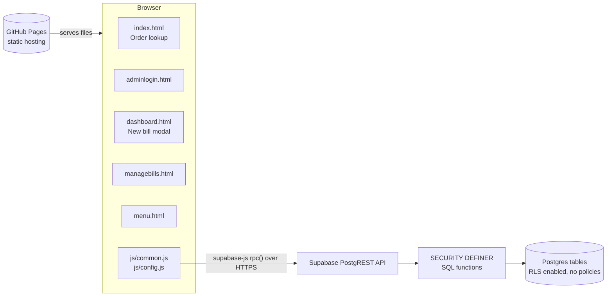
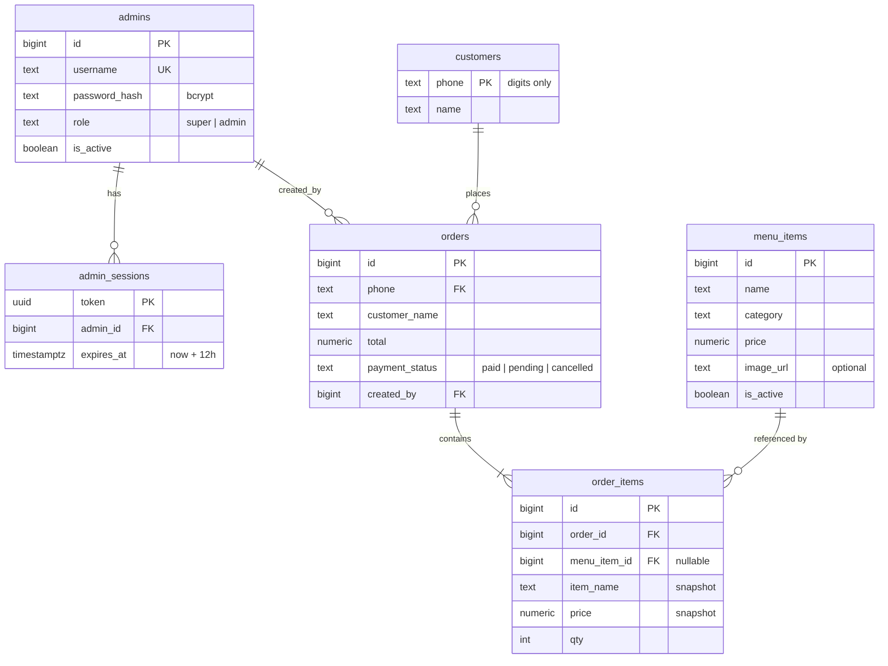
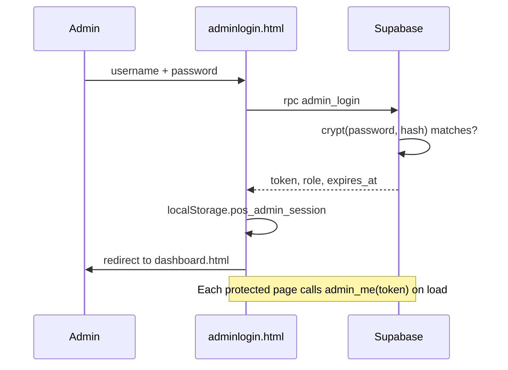
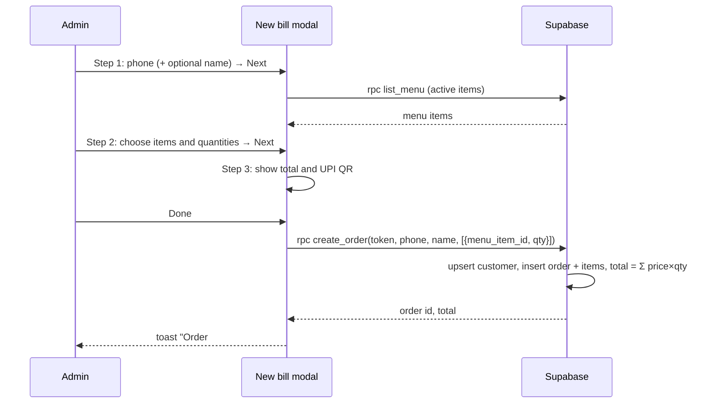

# Architecture

POS Billing is a static web app with no application server. The browser loads plain HTML/CSS/JS from GitHub Pages and talks directly to a Supabase Postgres database through RPC (remote procedure call) functions.

## High-level overview



| Layer | Technology | Responsibility |
|---|---|---|
| Hosting | GitHub Pages | Serves static files from the `main` branch |
| UI | HTML, CSS, vanilla JavaScript | Pages, forms, modal, rendering |
| Client SDK | `@supabase/supabase-js` v2 (CDN) | Calls database functions via `rpc()` |
| QR code | `qrcodejs` (CDN) | Renders the UPI payment QR on the payment step |
| API | Supabase PostgREST | Exposes Postgres functions as HTTP endpoints |
| Business logic + auth | PL/pgSQL functions | Login, sessions, role checks, order totals |
| Storage | Supabase Postgres | Admins, sessions, menu, customers, orders |

## Project structure

```
POS_Billing/
├── index.html          Public landing page: search order history by phone
├── adminlogin.html     Admin login form
├── dashboard.html      Admin dashboard (bento cards) + 3-step New bill modal
├── managebills.html    Super admin: list / search / status / delete orders
├── menu.html           Super admin: add / edit / hide / delete menu items
├── css/
│   └── style.css       Shared styles, responsive layout, dark mode
├── js/
│   ├── config.js       Supabase URL + publishable key, shop name, currency, UPI ID
│   └── common.js       Shared helpers exposed as window.App
├── supabase/
│   └── schema.sql      Tables, RLS, functions, grants (run once in SQL Editor)
└── docs/
    ├── ARCHITECTURE.md This file
    └── USER_GUIDE.md   Features and how to use them
```

Each HTML page loads scripts in this order: `supabase-js` → `config.js` → `common.js` → an inline page script.

### `js/common.js` (window.App)

| Helper | Purpose |
|---|---|
| `db` | Supabase client created from `APP_CONFIG` |
| `rpc(fn, args)` | Calls a database function; throws on error; on an expired session (`28000`) clears the session and redirects to login |
| `session.get/set/clear` | Stores the admin session in `localStorage` (`pos_admin_session`); ignores expired sessions |
| `requireAdmin({ superOnly })` | Page guard: validates token with `admin_me`, redirects to login or dashboard if not allowed |
| `logout()` | Deletes the server session and returns to login |
| `money`, `fmtDate`, `esc`, `digits` | Formatting, HTML escaping, phone normalisation |
| `toast(msg, type)` | Small notification popup |
| `renderItems(items)` | Renders order line items as a list |

## Database design



Design notes:
- **Price and name snapshots** in `order_items` keep old bills correct after a menu item is renamed, repriced or deleted (`menu_item_id` becomes `NULL`).
- **Phone numbers** are stored as digits only, so `98765 43210` and `9876543210` match the same customer.
- **Deleting an order** cascades to its `order_items`.
- Indexes: `orders(phone, created_at desc)` for lookup, `order_items(order_id)` for joins.

## Security model

The Supabase publishable (anon) key is public by design — it is in `config.js` and visible to anyone. Security therefore lives entirely in the database:

1. **RLS on, no policies.** Every table has Row Level Security enabled with zero policies, so the anon key cannot `select`, `insert`, `update` or `delete` any table directly.
2. **Access only through functions.** Functions are `SECURITY DEFINER`: they run as the owner and can touch tables, but only in the ways they are written to. `execute` is granted to `anon` only for the intended functions; the internal `_require_admin` helper is not callable from outside.
3. **Hashed passwords.** `admins.password_hash` uses bcrypt via `pgcrypto` (`crypt()` + `gen_salt('bf')`). Passwords never leave the database and are never returned to the browser.
4. **Session tokens.** `admin_login` returns a random UUID token valid for 12 hours, stored in `admin_sessions`. Every admin function receives `p_token` and calls `_require_admin(token, super_required)`.
5. **Roles enforced server-side.** Hiding cards in the UI is cosmetic; super-only functions raise `Super admin access required.` for a normal admin even if called directly.
6. **Server-side totals.** `create_order` receives only menu item IDs and quantities. Prices come from `menu_items`, and only active items are accepted.
7. **XSS protection.** All user-supplied text is passed through `App.esc()` before being inserted into HTML.

Known trade-off: `get_orders_by_phone` is public, so anyone who knows a phone number can see that customer's history (capped at 100 orders, minimum 6 digits). Add OTP verification if this is a concern.

## RPC function reference

| Function | Access | Description |
|---|---|---|
| `admin_login(p_username, p_password)` | Public | Verifies credentials, returns `{token, username, role, expires_at}` and clears expired sessions |
| `admin_logout(p_token)` | Public | Deletes the session |
| `admin_me(p_token)` | Any admin | Returns `{username, role}`; used as a page guard |
| `get_orders_by_phone(p_phone)` | Public | Customer order history with items, newest first |
| `list_menu(p_token, p_include_inactive)` | Any admin (active items); super admin (with hidden items) | Menu sorted by category and name |
| `create_order(p_token, p_phone, p_customer_name, p_items)` | Any admin | Upserts the customer, creates the order and items, computes the total |
| `upsert_menu_item(p_token, p_id, p_name, p_category, p_price, p_is_active, p_image_url)` | Super admin | Inserts when `p_id` is null, otherwise updates; image URL must be http(s) |
| `delete_menu_item(p_token, p_id)` | Super admin | Deletes a menu item |
| `list_orders(p_token, p_search, p_limit, p_offset)` | Super admin | Paged orders with items; searches phone, name or order ID |
| `update_order_status(p_token, p_id, p_status)` | Super admin | Sets `paid`, `pending` or `cancelled` |
| `delete_order(p_token, p_id)` | Super admin | Deletes an order and its items |

Error codes the client relies on: `28000` (session invalid/expired → redirect to login), `28P01` (bad credentials), `42501` (not super admin).

## Key flows

### Admin login



### New bill



### Customer lookup

`index.html` → `get_orders_by_phone(phone)` → renders each order card with items, total and status, plus total spent (excluding cancelled orders).

## Frontend design

- **Responsive:** CSS grid bento layout collapses from 3 → 2 → 1 columns (breakpoints 760px, 460px). Tables scroll horizontally inside `.table-wrap`. The modal is centred with `100dvh`-based max height so mobile browser bars don't clip the footer.
- **Theming:** CSS custom properties in `:root`, overridden under `prefers-color-scheme: dark`.
- **No build step:** no bundler or framework; edit files and push.

## Deployment

1. Run `supabase/schema.sql` once in the Supabase SQL Editor (safe to re-run: it uses `create ... if not exists` and `create or replace`).
2. Insert admin users with `crypt()` (see README).
3. Set values in `js/config.js`.
4. Push to `main`; GitHub Pages publishes from the repository root.

Cache busting: HTML pages load `css/style.css?v=N`, `js/config.js?v=N` and `js/common.js?v=N`. After changing any CSS/JS file, bump `N` in every HTML page so browsers fetch the new version instead of a cached copy.

Schema changes: update `schema.sql` (for fresh installs) and add a numbered file in `supabase/migrations/` for existing databases. Run new migration files in order in the SQL Editor, then commit both.

## Configuration

| Key (`js/config.js`) | Meaning |
|---|---|
| `SUPABASE_URL` | Project URL from Supabase → Project Settings → API |
| `SUPABASE_ANON_KEY` | Publishable/anon key (safe to publish). Never put the `service_role` / secret key here |
| `SHOP_NAME` | Shown in the header and as the UPI payee name |
| `CURRENCY` | Currency symbol used for display |
| `UPI_ID` | Payee address encoded in the payment QR |

## Possible future improvements

- OTP verification for customer order lookup.
- Mark orders `pending` until payment is confirmed instead of defaulting to `paid`.
- Printable / shareable receipts.
- Sales reports (daily totals, top items).
- Rate limiting on `admin_login` to slow down password guessing.
