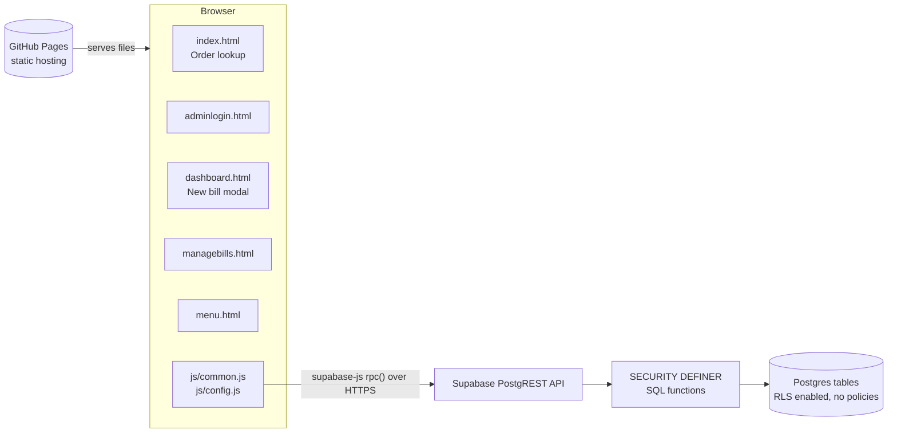
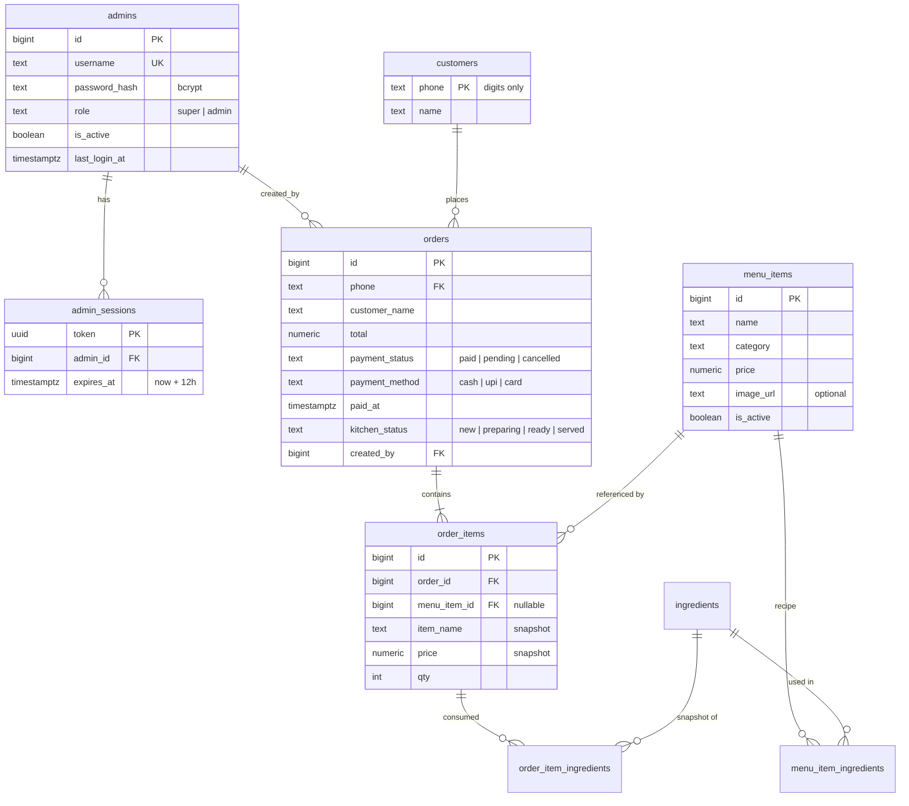
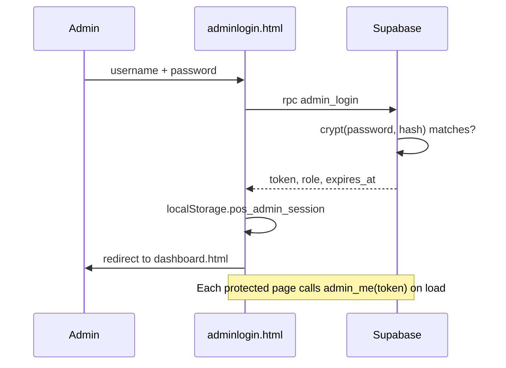
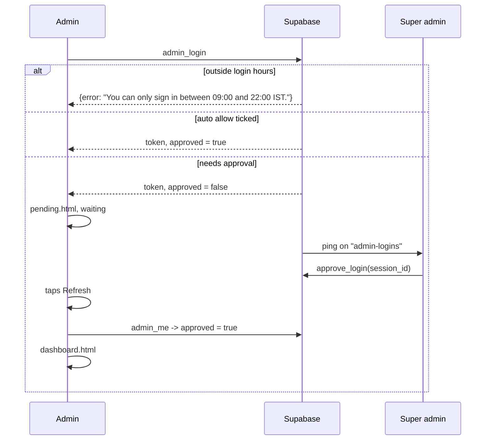
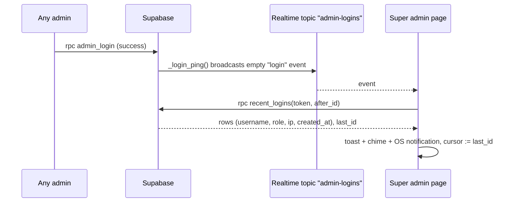
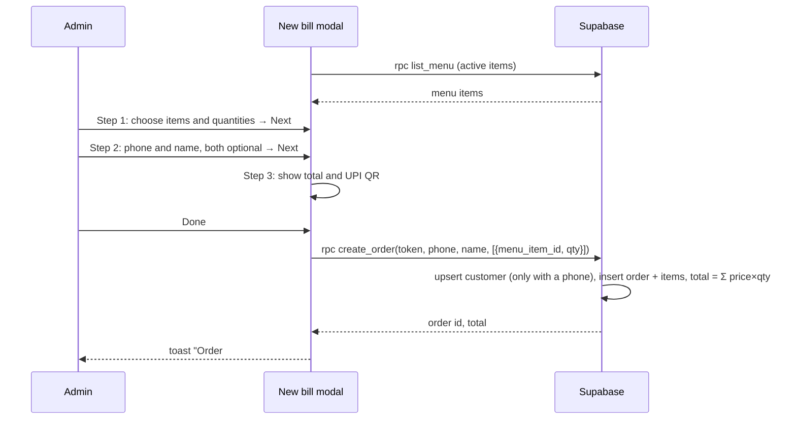

# Architecture

POS Billing is a static web app with no application server. The browser loads plain HTML/CSS/JS from GitHub Pages and talks directly to a Supabase Postgres database through RPC (remote procedure call) functions.

## High-level overview



| Layer | Technology | Responsibility |
|---|---|---|
| Hosting | GitHub Pages | Serves static files from the `main` branch |
| UI | HTML, CSS, vanilla JavaScript | Pages, forms, modal, rendering |
| Client SDK | `@supabase/supabase-js` v2 (CDN) | Calls database functions via `rpc()` |
| QR code | `qrcodejs` (CDN) | Renders the UPI payment QR on the payment step |
| API | Supabase PostgREST | Exposes Postgres functions as HTTP endpoints |
| Business logic + auth | PL/pgSQL functions | Login, sessions, role checks, order totals |
| Storage | Supabase Postgres | Admins, sessions, menu, customers, orders |

## Project structure

```
POS_Billing/
├── index.html          Public home page: hero + open status, live kitchen board, favourites, menu, WhatsApp basket, visit info, order lookup
├── adminlogin.html     Admin login form
├── dashboard.html      Admin dashboard: shift bar, bento cards, awaiting payment, New bill modal, shift modal
├── managebills.html    Super admin: list / search / status / delete orders
├── menu.html           Super admin: add / edit / hide / delete menu items, link ingredients
├── ingredients.html    Super admin: ingredients, stock purchase / waste / count, tracking, history
├── usage.html          Super admin: ingredient usage report (IST days, CSV export)
├── staff.html          Super admin: users, roles, password resets, sign-outs
├── settings.html       Super admin: shop name, address, UPI ID, currency, receipt footer
├── audit.html          Super admin: audit log with area filter and search
├── account.html        Any admin: change own password
├── kitchen.html        Any admin: kitchen display (new / preparing / ready columns, live refresh, chime)
├── coupons.html        Super admin: create / edit / switch off coupons, usage and discount given
├── sales.html          Super admin: sales KPIs, by-day / by-hour bars, methods, top items, staff, shift closes
├── pending.html        Holding page for an admin whose sign-in is waiting for a super admin
├── offline.html        Shown by the service worker when a page is opened with no connection
├── manifest.webmanifest  PWA manifest: name, icons, colours, standalone display, shortcuts
├── sw.js               Service worker: offline shell cache, notification clicks
├── icons/              App icons (192, 512, maskable 512, apple touch, notification badge)
├── css/
│   └── style.css       Shared styles, responsive layout, dark mode
├── js/
│   ├── config.js       Supabase URL + publishable key; fallback shop settings
│   ├── common.js       Shared helpers exposed as window.App
│   ├── notify.js       Service worker registration, install button, sign-in alerts and approvals
│   └── shell.js       Profile avatar, side drawer and the phone/tablet bottom bar
├── supabase/
│   └── schema.sql      Tables, RLS, functions, grants (run once in SQL Editor)
└── docs/
    ├── ARCHITECTURE.md This file
    └── USER_GUIDE.md   Features and how to use them
```

Each HTML page loads scripts in this order: `supabase-js` → `config.js` → `common.js` → `notify.js` → `shell.js` (admin pages only) → an inline page script.

### `js/common.js` (window.App)

| Helper | Purpose |
|---|---|
| `db` | Supabase client created from `APP_CONFIG` |
| `applySettings(s)` | Merges `get_settings()` into `cfg` (cached in `localStorage` as `pos_settings` for first paint) and updates `[data-shop-name]`. Loaded on every page; `requireAdmin` waits for it |
| `upiConfigured()` | False while the UPI ID is empty or the sample; `renderQR` then shows a warning |
| `rpc(fn, args)` | Calls a database function; throws on error; on an expired session (`28000`) clears the session and redirects to login |
| `session.get/set/clear` | Stores the admin session in `localStorage` (`pos_admin_session`); ignores expired sessions |
| `requireAdmin({ superOnly })` | Page guard: validates token with `admin_me`, redirects to login or dashboard if not allowed |
| `logout()` | Deletes the server session and returns to login |
| `money`, `fmtDate`, `esc`, `digits` | Formatting, HTML escaping, phone normalisation |
| `toast(msg, type)` | Small notification popup |
| `confirm({title, message, okText, cancelText, danger})` | In-app replacement for `window.confirm`; resolves `true`/`false`. `danger` gives a red OK button and starts focus on Cancel. Centred on desktop, bottom sheet on phones. Esc, Cancel and a click outside all cancel. The page code must not call the native `confirm`/`prompt`/`alert` |
| `prompt({title, message, okText, input: {type, inputmode, placeholder, value, label}})` | In-app replacement for `window.prompt`; resolves the typed text or `null`. Enter submits |
| `renderItems(items)` | Renders order line items as a list |
| `methodLabel(m)` | `cash`/`upi`/`card` → display label |
| `renderQR(el, amount)` | Draws the UPI payment QR for an amount |
| `printReceipt(order)` | Fills a hidden `#receipt-print` block (58 mm layout, print-only CSS) and opens the print dialog |
| `printShiftReport(shift)`, `cashDiff(d)` | 58 mm shift report; counted − expected → Short by / Over by / Exact match |
| `whatsappUrl(order)` | `wa.me` link with the bill summary; prefixes `COUNTRY_CODE` to 10-digit phones |
| `setWhatsapp(el, order)` | Points a link at `whatsappUrl(order)`, or greys it out (`aria-disabled`, no `href`) when the order has no phone |

## Database design



Other tables (not all columns shown above):
- `settings` — exactly one row (`id = 1`): shop name, address, phone, currency, UPI ID, country code, receipt footer.
- `audit_log(admin_id, admin_username snapshot, action, entity_id, details jsonb, created_at)` — `action` is `area.verb` (`order.status`, `menu.update`, `staff.create`, …). Updates store `details.changes = {field: [old, new]}` (built by `_jsonb_diff`); deletes store a snapshot of the row.
- `shifts(admin_id, opened_at, opening_cash, closed_at, closed_by, counted_cash, expected_cash, difference, totals jsonb, note)` — one open shift per admin (partial unique index). Expected cash = opening + that admin's paid cash bills created during the shift; `totals` (cash/upi/card/sales/pending/cancelled) is frozen at close.
- `ingredients` also has `track_stock`, `stock`, `low_stock_at`; `settings.hide_out_of_stock` (default true).
- `stock_movements(ingredient_id, kind purchase|waste|adjust|sale|sale_reversal, qty signed, balance_after, order_id, admin_id, note)` — every stock change.
- `coupons(code unique case-insensitive, description, kind percent|flat|bogo, value, max_discount, min_bill, buy_qty, get_qty, applies_to all|items, item_ids[], categories[], valid_from, valid_to (IST dates), usage_limit, per_customer_limit, is_active)`.
- `orders` also has `subtotal` (before discount), `discount`, `coupon_id` (set null if the coupon is deleted) and `coupon_code` (snapshot). `total` is always the amount charged, so every report uses the discounted figure.
- `login_attempts(username, ip, succeeded, created_at)` — rate-limit window, purged after a day.
- `ingredients(id, name unique case-insensitive, unit in g|kg|ml|l|pcs)`
- `menu_item_ingredients(menu_item_id, ingredient_id, qty)` — quantity per **one** unit of the menu item; PK on both IDs.
- `order_item_ingredients(order_id, order_item_id, ingredient_id nullable, ingredient_name, unit, qty)` — written by `create_order` as recipe qty × ordered qty.

Design notes:
- **Ingredient snapshots** make a daily consumption report a simple query that is unaffected by later recipe edits:
  ```sql
  select (o.created_at at time zone 'Asia/Kolkata')::date as day, oii.ingredient_name, oii.unit, sum(oii.qty) as total
  from order_item_ingredients oii join orders o on o.id = oii.order_id
  where o.payment_status <> 'cancelled'
  group by 1, 2, 3 order by 1 desc, 2;
  ```
- **Price and name snapshots** in `order_items` keep old bills correct after a menu item is renamed, repriced or deleted (`menu_item_id` becomes `NULL`).
- **Phone numbers** are stored as digits only, so `98765 43210` and `9876543210` match the same customer.
- **Deleting an order** cascades to its `order_items`.
- **Stock.** `create_order` calls `_stock_deduct_order` after writing the ingredient snapshot: tracked ingredients are locked (`for update`, id order) and reduced; with `hide_out_of_stock` on it raises `Not enough …` (whole bill rolls back), otherwise it allows negative stock and returns `stock_warnings`. Cancelling or deleting a non-cancelled bill runs `_stock_restore_order`, which reverses the order's net movements; un-cancelling deducts again. Untracked ingredients are ignored.
- **Kitchen live refresh.** A statement trigger on `orders` (insert, delete, update of `kitchen_status`/`payment_status`) calls `realtime.send('{}', 'orders', 'kitchen', false)`: an empty broadcast on a public Realtime topic. No order data is broadcast; `kitchen.html` reacts by calling `kitchen_orders(token)`, and also polls every 10 s. The trigger swallows errors and is skipped if Realtime is missing, so billing never fails because of it. Orders existing when migration 009 ran were marked `served`.
- Indexes: `orders(phone, created_at desc)` for lookup, `order_items(order_id)` for joins.

## Security model

The Supabase publishable (anon) key is public by design — it is in `config.js` and visible to anyone. Security therefore lives entirely in the database:

1. **RLS on, no policies.** Every table has Row Level Security enabled with zero policies, so the anon key cannot `select`, `insert`, `update` or `delete` any table directly.
2. **Access only through functions.** Functions are `SECURITY DEFINER`: they run as the owner and can touch tables, but only in the ways they are written to. `execute` is granted to `anon` only for the intended functions; the internal `_require_admin` helper is not callable from outside.
3. **Hashed passwords.** `admins.password_hash` uses bcrypt via `pgcrypto` (`crypt()` + `gen_salt('bf')`). Passwords never leave the database and are never returned to the browser. Empty or null passwords are always rejected.
4. **Login rate limit.** `admin_login` records every attempt in `login_attempts` (username, client IP from `x-forwarded-for`). 5 failures per username (reset by a success) or 20 per IP within 15 minutes block further attempts. Rows older than a day are purged on each login. Trade-off: someone who knows a username can keep it locked; the IP limit and the short window keep that small.
5. **Audit trail.** Every super admin change (and payment confirmations) writes to `audit_log` inside the same transaction as the change. The log has no update/delete RPC.
6. **Session tokens.** `admin_login` returns a random UUID token valid for 12 hours, stored in `admin_sessions`. Every admin function receives `p_token` and calls `_require_admin(token, super_required)`.
7. **Roles enforced server-side.** Hiding cards in the UI is cosmetic; super-only functions raise `Super admin access required.` for a normal admin even if called directly.
8. **Server-side totals.** `create_order` receives only menu item IDs, quantities and an optional coupon code. Prices come from `menu_items`, only active items are accepted, and the discount is recomputed from the `coupons` row; the amount shown by `check_coupon` is only a preview.
9. **XSS protection.** All user-supplied text is passed through `App.esc()` before being inserted into HTML.

Public home page data: `public_kitchen()` and `public_menu()` are callable without login. They are read-only and return only order numbers, item names/quantities per ticket and kitchen status, plus the menu. Visitors can infer roughly how busy the shop is.

Known trade-off: `get_orders_by_phone` is public, so anyone who knows a phone number can see that customer's history (capped at 100 orders, minimum 6 digits). Add OTP verification if this is a concern.

## RPC function reference

| Function | Access | Description |
|---|---|---|
| `admin_login(p_username, p_password)` | Public | Rate-limited (5 failures per username or 20 per IP in 15 min). Returns `{token, username, role, expires_at}` or `{error}` (errors are returned, not raised, so failed attempts are recorded) |
| `admin_logout(p_token)` | Public | Deletes the session |
| `admin_me(p_token)` | Any admin, even while waiting | `{username, role, approved, in_window, window}`; used as a page guard |
| `recent_logins(p_token, p_after_id)` | Super admin | Successful logins newer than `p_after_id` (max 20, last hour only) plus `last_id` and `server_time`. `p_after_id` null = bootstrap: cursor only, no rows |
| `change_my_password(p_token, p_current, p_new)` | Any admin | Verifies current password, min 8 chars, signs out the user's other sessions; audited |
| `get_settings()` | Public | Shop settings, including home page fields (`tagline`, `whatsapp`, `maps_url`, `cover_image_url`, `opening_hours`) |
| `public_kitchen()` | Public | Live board: `queued`, `preparing`, `ready` (id, kitchen status, times, items; max 12 each, last 12h, not cancelled) and `orders_today`, `served_today` (IST). No names, phones, totals or payment data |
| `public_menu()` | Public | Active items (name, category, price, image, stock ok/low/out) and up to 6 favourite item ids (most paid qty, 7 days). No quantities exposed |
| `update_settings(p_token, p_settings)` | Super admin | Validates and saves all settings; audited with changed fields |
| `list_admins(p_token)` | Super admin | Users with last login, active session count, `is_me` |
| `upsert_admin(p_token, p_id, p_username, p_role, p_is_active, p_password, p_login_from, p_login_to, p_auto_approve)` | Super admin | Create (password required) or update (blank password keeps it). Can't demote/disable yourself. Role/password change or deactivation deletes that user's sessions; audited |
| `revoke_admin_sessions(p_token, p_id)` | Super admin | Deletes a user's sessions (keeps the caller's); returns count; audited |
| `pending_logins(p_token)` | Super admin | Sign-ins still waiting: `{session_id, username, role, ip, created_at, login_window}`, oldest first. Sessions whose login hours have since ended are left out |
| `approve_login(p_token, p_session_id)` | Super admin | Lets that one sign-in through; audited |
| `deny_login(p_token, p_session_id)` | Super admin | Deletes that session, so the device is signed out; audited |
| `list_audit_log(p_token, p_category, p_search, p_limit, p_offset)` | Super admin | Paged log; category = action prefix (`order`, `menu`, `ingredient`, `staff`, `settings`); search matches user, entity ID or details text |
| `kitchen_orders(p_token)` | Any admin | `{server_time, active, served}`: active = not served/cancelled from the last 24h (oldest first, max 100); served = last 10 served in 2h |
| `set_kitchen_status(p_token, p_id, p_status)` | Any admin | `new`/`preparing`/`ready`/`served`; rejects cancelled orders; audited |
| `menu_stock(p_token)` | Any admin | `{hide_out_of_stock, items: {menu_item_id: {status ok|low|out, can_make, short:[{name, unit, stock, need}]}}}` for items with tracked ingredients |
| `low_stock(p_token)` | Any admin | Tracked ingredients at or below `low_stock_at` (or zero) |
| `record_stock(p_token, p_ingredient_id, p_kind, p_qty, p_note)` | Super admin | `purchase` (+), `waste` (−), `count` (set); turns tracking on; audited |
| `update_stock_settings(p_token, p_id, p_track, p_low_stock_at)` | Super admin | Tracking on/off and alert level; audited |
| `list_stock_movements(p_token, p_ingredient_id, p_limit)` | Super admin | Latest movements (max 200) |
| `current_shift(p_token)` | Any admin | Own open shift with live totals and expected cash, or `null` |
| `open_shift(p_token, p_opening_cash)` | Any admin | Opens a shift; one open shift per user; audited |
| `close_shift(p_token, p_counted_cash, p_note, p_shift_id?)` | Any admin (own) / super admin (any, by id) | Freezes totals, stores expected/counted/difference; audited |
| `list_shifts(p_token, p_from, p_to)` | Super admin | Shifts opened between IST dates (max 200) |
| `sales_report(p_token, p_from, p_to)` | Super admin | IST range (max 1 year): `summary` (paid orders, sales, avg), `pending`, `cancelled`, `by_method`, `by_day` (every day filled), `by_hour` (0–23), `top_items` (top 10 by revenue), `by_staff` |
| `get_orders_by_phone(p_phone)` | Public | Customer order history with items, newest first |
| `list_menu(p_token, p_include_inactive)` | Any admin (active items); super admin (with hidden items) | Menu sorted by category and name |
| `create_order(p_token, p_phone, p_customer_name, p_items, p_payment_method, p_coupon_code?)` | Any admin | Phone is optional (blank → `orders.phone` null, no customer row); a number that is given must be 10 digits. Upserts the customer, creates the order and items, computes the total. With a coupon code, re-checks it via `_coupon_quote` with the coupon row locked (so usage limits hold) and stores subtotal/discount/code; any coupon error rolls the bill back. `cash`/`card` → `paid`; `upi` → `pending`. Returns the full order (receipt shape) |
| `check_coupon(p_token, p_code, p_phone, p_items)` | Any admin | Preview for the payment step: `{coupon_id, code, description, kind, subtotal, discount, total}`, or raises a readable reason (does not exist, switched off, not started / expired, below minimum bill, covers no item, used up, needs phone, customer already used it) |
| `list_coupons(p_token)` | Super admin | All coupons with `uses` and `discount_given` (non-cancelled bills) |
| `upsert_coupon(p_token, p_id, p_coupon jsonb)` | Super admin | Create (`p_id` null) or update; validates and normalises; audited `coupon.create` / `coupon.update` |
| `delete_coupon(p_token, p_id)` | Super admin | Deletes; bills keep `coupon_code`; audited `coupon.delete` |
| `mark_order_paid(p_token, p_id, p_method?)` | Any admin | `pending` → `paid`, sets `paid_at`; no-op if already paid |
| `list_pending_orders(p_token)` | Any admin | Orders awaiting payment, newest first (max 50) |
| `get_order(p_token, p_id)` | Any admin | One order with items, method, status, creator |
| `upsert_menu_item(p_token, p_id, p_name, p_category, p_price, p_is_active, p_image_url)` | Super admin | Inserts when `p_id` is null, otherwise updates; image URL must be http(s) |
| `delete_menu_item(p_token, p_id)` | Super admin | Deletes a menu item (and its recipe) |
| `list_ingredients(p_token)` | Super admin | Ingredients with `used_count` |
| `upsert_ingredient(p_token, p_id, p_name, p_unit)` | Super admin | Insert/update; unique name |
| `delete_ingredient(p_token, p_id)` | Super admin | Deletes; removed from recipes, order snapshots kept |
| `list_menu_recipes(p_token)` | Super admin | `{menu_item_id: [{ingredient_id, name, unit, qty}]}` |
| `set_menu_item_ingredients(p_token, p_menu_item_id, p_items)` | Super admin | Replaces an item's recipe; `p_items` = `[{ingredient_id, qty}]` |
| `ingredient_usage(p_token, p_from, p_to, p_by_day)` | Super admin | Sums `order_item_ingredients` for non-cancelled orders between IST dates (max 1 year); returns `{from, to, order_count, orders_with_ingredients, rows:[{day?, name, unit, total}]}` |
| `list_orders(p_token, p_search, p_limit, p_offset)` | Super admin | Paged orders with items; searches phone, name or order ID |
| `update_order_status(p_token, p_id, p_status)` | Super admin | Sets `paid`, `pending` or `cancelled` |
| `delete_order(p_token, p_id)` | Super admin | Deletes an order and its items |

Error codes the client relies on: `28000` (session invalid/expired, or the login window has closed → redirect to login with the reason), `28002` (signed in but not yet approved → redirect to `pending.html`), `28P01` (bad credentials), `42501` (not super admin).

## Key flows

### Admin login



### Login hours and approval

Two gates stand between an admin and the dashboard. Both are enforced in the
database, on every RPC, not just in the UI. Super admins are never gated — if
they were, nobody could unlock anyone.

| Gate | Stored on | Checked | Failure |
|---|---|---|---|
| Login hours | `admins.login_from` / `login_to` (IST, null = any time) | `admin_login`, and `_require_admin` on every later call | `28000` — the session ends and the login page says why |
| Approval | `admin_sessions.approved_at` (set at login when `admins.auto_approve`) | `_require_admin` | `28002` — the browser goes to `pending.html` |



Details worth knowing:

- **A window may wrap midnight.** `17:00`–`02:00` means the evening shift; the
  check is written as two ranges in that case. `_within_login_window` owns this.
- **Approval lasts exactly as long as that day's window.** Nothing expires the
  approval itself; the hours check simply keeps running on every call, so when
  the shift ends the session stops working. With no hours set, approval lasts
  until the 12-hour session expires.
- **Approval is per device.** A second device means a second sign-in and a
  second approval.
- **`admin_me` is deliberately outside the gate** (it uses `_session_admin`, not
  `_require_admin`), because `pending.html` has to be able to ask whether it has
  been let in yet.
- **Denying deletes the session**, so that device is signed out and can try again.
- **Existing accounts were not locked out**: migration 013 sets `auto_approve`
  on every account that already existed, and marks every live session approved.
  Gating starts when a super admin unticks **Auto allow** for someone.
- **Signing a user out of every device** is the older `revoke_admin_sessions`,
  still on the Staff page. It removes approved and waiting sessions alike.

### Sign-in alerts (super admin)



The ping carries no data because the topic is public, exactly like `kitchen`.
Details come from `recent_logins`, which requires a super admin token.

`js/notify.js` runs the listener. `requireAdmin` starts it whenever the signed-in
user is a super admin, so it works on every admin page, not just the dashboard.

- **Cursor:** `login_attempts.id`, stored in `localStorage` as `pos_login_cursor`.
  The first poll of a browser only learns the cursor and shows nothing, and the
  function never returns rows older than an hour, so a stale cursor cannot replay
  a day of logins as fresh alerts.
- **Fallback:** a 60-second poll while the tab is visible, plus a poll on
  `visibilitychange`, covers a missed broadcast.
- **Own logins are skipped** by username, so a super admin is not alerted about
  their own sign-in on this device.
- **Duplicates:** every open tab may alert, but the notification `tag`
  (`login-<id>`) means the operating system shows one notification per sign-in.
- **On/off:** the 🔔 button injected into the top bar. The preference lives in
  `localStorage` (`pos_login_alerts`); the click is also the user gesture that
  browsers require before asking for notification permission and before audio
  can play.
- **Approvals ride along.** Each poll also calls `pending_logins`, so an alert
  about someone who is waiting carries **Approve** / **Deny** — on the toast, and
  as notification action buttons. `App.approvals.onChange` lets a page draw the
  same list; `dashboard.html` uses it for the banner. Answering from a
  notification is relayed by `sw.js` to an open page (which holds the token); with
  no page open it opens `dashboard.html?approve=<id>`, which acts on it.

## PWA

`manifest.webmanifest` + `sw.js` + `icons/` make the app installable on Android,
Windows, macOS and iOS. Paths are relative, so this works both at a domain root
and under a GitHub Pages project path (`/<repo>/`).

`sw.js` caching:

| Request | Strategy |
|---|---|
| `*.supabase.co` / `*.supabase.in` (REST, Realtime, Storage) | Never touched — always the network |
| Navigations (HTML) | Network first, cache fallback, then `offline.html` |
| CSS, JS, icons, CDN libraries | Cache first, refreshed in the background |

The cache name (`pos-shell-v1`) must be bumped whenever the precached file list
changes; `activate` deletes every other cache. A waiting worker is told to
`SKIP_WAITING` as soon as it installs, so a new version takes over on the next load.

The service worker also owns `notificationclick`: it focuses an open app window
(or opens `dashboard.html`) and navigates to the notification's `data.url`.
Notifications are shown via `registration.showNotification`, because the
`Notification` constructor is unavailable on Android Chrome.

An **Install app** button appears in the top bar when the browser fires
`beforeinstallprompt` (Chrome, Edge, Android). Safari and Firefox never fire it;
there the user installs from the browser menu.

### New bill



### Customer lookup

`index.html` → `get_orders_by_phone(phone)` → renders each order card with items, total and status, plus total spent (excluding cancelled orders).

## Frontend design

- **Navigation:** every signed-in admin page gets the same shell from `js/shell.js`, mounted by `requireAdmin`. A round avatar sits in the top bar; tapping it opens a right-hand drawer with the whole menu and Logout. The old name chip, Account link and Logout button are gone from the page markup. `NAV` in that file is the single list of destinations; `super: true` items are dropped for plain admins.
- **Bottom bar:** at 900px and below every bento card except **New bill** is hidden and a fixed bottom bar takes over, phone-app style: the `bar: true` destinations plus **More**, which opens the drawer. New bill is in neither the bar nor the drawer — its card stays on the home page under the shift bar, because it is the one thing done all day.
- **On-screen keyboard:** the viewport meta carries `interactive-widget=resizes-content`, so on Android Chrome the layout viewport shrinks when the keyboard opens and fixed footers ride above it. For browsers that do not honour it (notably iOS Safari) `common.js` watches `visualViewport` and publishes the covered height as `--kb`; the full-screen New bill modal is `height: calc(100% - var(--kb))`, which keeps the cart bar and **Next** in view while typing. Gaps under 60px are ignored, since those are the browser's own toolbars.
- **Responsive:** CSS grid bento layout collapses from 3 → 2 → 1 columns (breakpoints 760px, 460px), and below 900px only the New bill card is left, with the bottom bar carrying the rest. Tables scroll horizontally inside `.table-wrap`. The modal is centred with `100dvh`-based max height so mobile browser bars don't clip the footer.
- **Theming:** CSS custom properties in `:root`, overridden under `prefers-color-scheme: dark`.
- **No build step:** no bundler or framework; edit files and push.

## Deployment

1. Run `supabase/schema.sql` once in the Supabase SQL Editor (safe to re-run: it uses `create ... if not exists` and `create or replace`).
2. Insert admin users with `crypt()` (see README).
3. Set values in `js/config.js`.
4. Push to `main`; GitHub Pages publishes from the repository root.

Cache busting: HTML pages load `css/style.css?v=N`, `js/config.js?v=N`, `js/common.js?v=N`, `js/notify.js?v=N` and `js/shell.js?v=N`. After changing any CSS/JS file, bump `N` in every HTML page, and bump `CACHE` in `sw.js` so installed copies of the app fetch the new shell instead of serving the cached one.

Schema changes: update `schema.sql` (for fresh installs) and add a numbered file in `supabase/migrations/` for existing databases. Run new migration files in order in the SQL Editor, then commit both.

## Configuration

| Key (`js/config.js`) | Meaning |
|---|---|
| `SUPABASE_URL` | Project URL from Supabase → Project Settings → API |
| `SUPABASE_ANON_KEY` | Publishable/anon key (safe to publish). Never put the `service_role` / secret key here |
| `SHOP_NAME` | Fallback until `get_settings()` loads (real value is on the Settings page) |
| `CURRENCY` | Currency symbol used for display |
| `UPI_ID` | Payee address encoded in the payment QR |
| `COUNTRY_CODE` | Prefix for 10-digit phone numbers in WhatsApp receipt links (default `91`) |

## Possible future improvements

- Web Push for sign-in alerts, so a super admin is notified with no page open (service worker `push` handler, VAPID keys, a `push_subscriptions` table and an Edge Function called from the database).
- OTP verification for customer order lookup.
